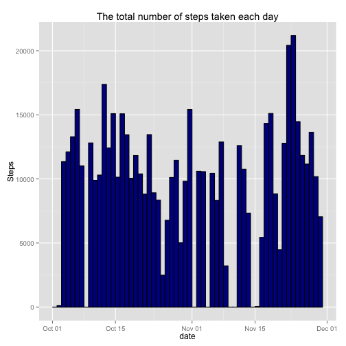
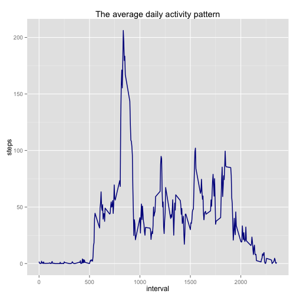
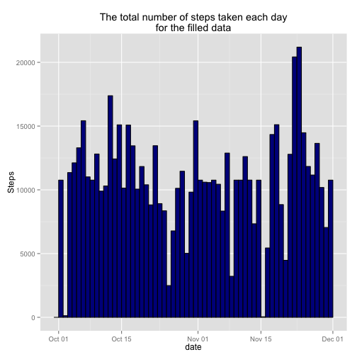
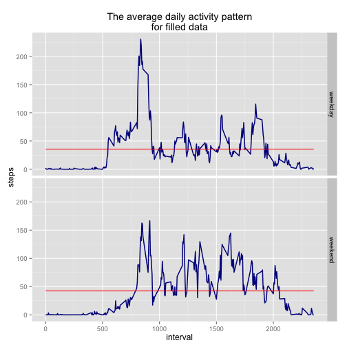

# Reproducible Research: Peer Assessment 1


## Loading and preprocessing the data


```r
data <- read.csv("activity.csv", stringsAsFactors = FALSE)
data <- transform(data, date = as.Date(date, "%Y-%m-%d"))  #transform to Date format
complete.data <- subset(data, complete.cases(data))  #complete cases only

# required libraries
library(plyr)
library(ggplot2)
```


## What is mean total number of steps taken per day?


```r
# total steps by day
steps.by.day <- ddply(complete.data, .(date), .fun = function(x) {
    return(sum(x$steps))
})
colnames(steps.by.day)[2] <- "steps"

# plot
g <- ggplot(steps.by.day, aes(x = date))
g + geom_histogram(aes(weight = steps), binwidth = 1, color = "black", fill = "darkblue") + 
    ggtitle("The total number of steps taken each day") + ylab("Steps")
```

 

```r

# mean & median
mean <- mean(steps.by.day$steps)
median <- median(steps.by.day$steps)
```


The mean total number of steps taken per day is 1.0766 &times; 10<sup>4</sup>.
The median total number of steps taken per day is 10765.

## What is the average daily activity pattern?


```r
# avg steps by interval
avg.steps <- ddply(complete.data, .(interval), .fun = function(x) {
    return(mean(x$steps))
})
colnames(avg.steps)[2] <- "steps"

# plot
g <- ggplot(avg.steps, aes(x = interval, y = steps))
g + geom_line(color = "darkblue", lwd = 0.7) + ggtitle("The average daily activity pattern")
```

 

```r

# interval with max average steps
max.interval <- avg.steps$interval[which.max(avg.steps$steps)]
```


The 5-minute interval, that contains the maximum average number of steps, is 835.

## Imputing missing values


```r
complete <- complete.cases(data)
missing.val <- sum(!complete)
```


The total number of rows with NAs is 2304.

Here is the the code, that fills all the missing values with the mean for that 5-minute interval.


```r
# calc average steps (rounded)
avg.steps.round <- ddply(complete.data, .(interval), .fun = function(x) {
    return(round(mean(x$steps)))
})
colnames(avg.steps.round)[2] <- "steps"

# function that fills the missing values in x$steps supposed that x$interval
# takes one value (so that length(unique(x$interval)) = 1)
fill.missing <- function(x, fill.data) {
    i <- which(fill.data$interval == x$interval[1])
    x$steps <- rep(fill.data$steps[i], dim(x)[1])
    return(x)
}

# fill all the missing data and put results in tmp
tmp <- ddply(data[!complete, ], .(interval), .fun = fill.missing, fill.data = avg.steps.round)

# new data set with the missing data filled in
filled.data <- data
filled.data[!complete, ] <- tmp

# total steps by day
steps.by.day.filled <- ddply(filled.data, .(date), .fun = function(x) {
    return(sum(x$steps))
})
colnames(steps.by.day.filled)[2] <- "steps"
```


This is a histogram of the total number of steps taken each day.


```r
# plot
g <- ggplot(steps.by.day.filled, aes(x = date))
g + geom_histogram(aes(weight = steps), binwidth = 1, color = "black", fill = "darkblue") + 
    ggtitle("The total number of steps taken each day\nfor the filled data") + 
    ylab("Steps")
```

 

```r

# mean & median
mean.filled <- mean(steps.by.day.filled$steps)
median.filled <- median(steps.by.day.filled$steps)
```


The mean total number of steps taken per day for the filled data is 1.0766 &times; 10<sup>4</sup>.
The median total number of steps taken per day for the filled data is 1.0762 &times; 10<sup>4</sup>.

The values of the mean and median almost did not change.

Because I filled the missing values with the mean values, the daily number of steps increased in some days. In the histograms you can see more bars that are close to the mean value. Filling the missing values can change the probability distribution of the variables.

## Are there differences in activity patterns between weekdays and weekends?


```r
# Create a new factor variable in the dataset with two levels -- 'weekday'
# and 'weekend' indicating whether a given date is a weekday or weekend day.
filled.data$weekday <- weekdays(filled.data$date)
filled.data$day.type <- factor(ifelse(filled.data$weekday %in% c("Sunday", "Saturday"), 
    "weekend", "weekday"))

# Make a panel plot containing a time series plot (i.e. type = 'l') of the
# 5-minute interval (x-axis) and the average number of steps taken, averaged
# across all weekday days or weekend days (y-axis).

# avg steps by interval & day.type
avg.steps.filled <- ddply(filled.data, .(interval, day.type), .fun = function(x) {
    return(mean(x$steps))
})
colnames(avg.steps.filled)[3] <- "steps"

# plot
g <- ggplot(avg.steps.filled, aes(x = interval, y = steps))
g + geom_line(color = "darkblue", lwd = 0.7) + ggtitle("The average daily activity pattern\nfor filled data") + 
    geom_line(aes(y = steps), stat = "hline", yintercept = "mean", color = "red") + 
    facet_grid(day.type ~ .)
```

 

According to the plot the main difference between the activity patterns is the maximum value. Weekend activity pattern does not have a big "pike" about the 835 interval. Also the mean value for the weekend is a bit higher because there are more values between 100 and 150 than in the weekday pattern.
